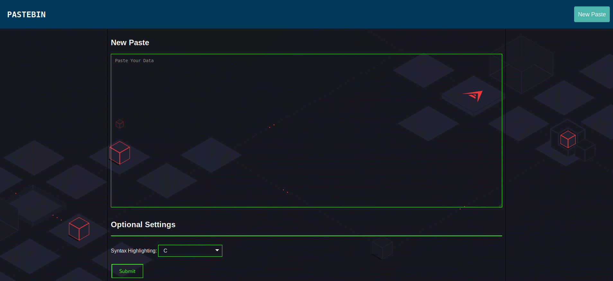
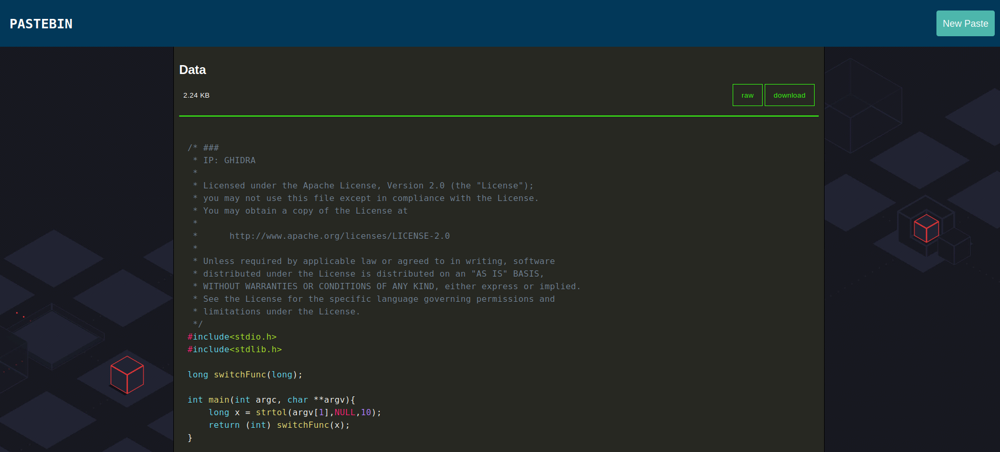

# Django Pastebin
*A simple pastebin.*




## Descrition
A simple, open source pastebin based on python3 and django.  
It has syntax highlighting features for various languages and is easy to setup.  
It also comes with a tool which can be used to directly upload pastes through command line.

## Cli tool
[](https://asciinema.org/a/R1a62ZUNhZRwdeXggjHzLuvj8)


## Prerequisites
```
pip3 install -r requirements.txt
```

## Database
This project can be used with both mysql and postgresql.
### Mysql setup
```
create database pastebin;
grant all privileges on pastebin.* to 'user'@'localhost' identified by 'password';
flush privileges;
use pastebin;
create table pastes ( url varchar(40), data text, lang varchar(40) );
exit;
```
settings.py
```
DATABASES = {
    'default': {
        'ENGINE': 'django.db.backends.mysql',
        'NAME': 'pastebin',
        'USER': 'user',
        'PASSWORD': 'password',
        'HOST': '',
        'PORT': '',
    }
}
```
